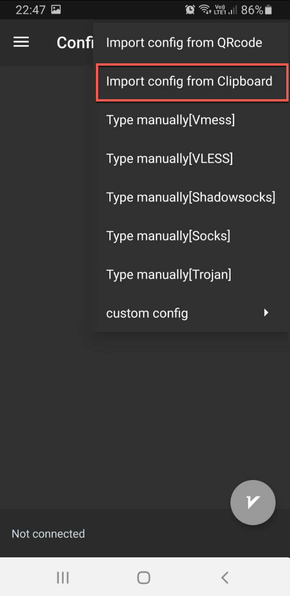
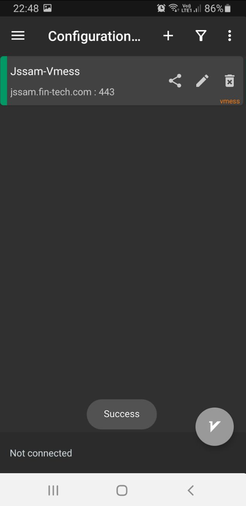
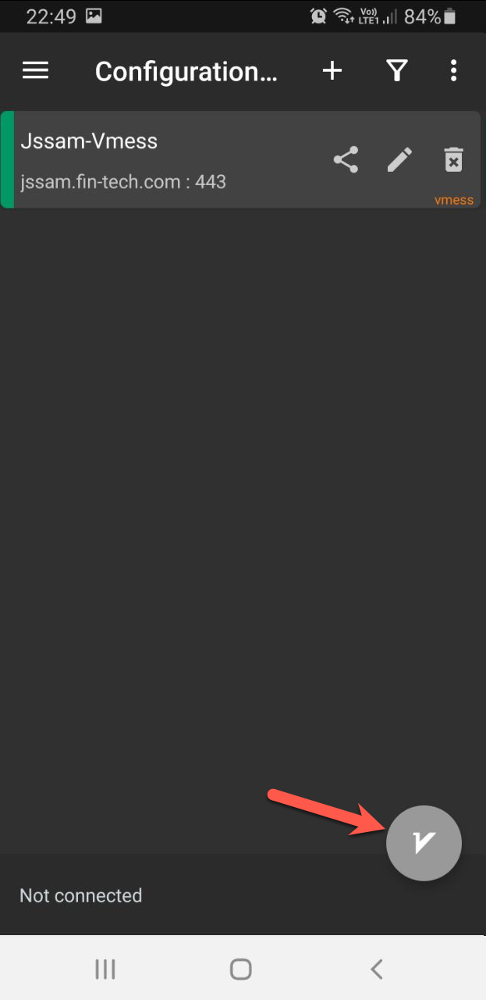
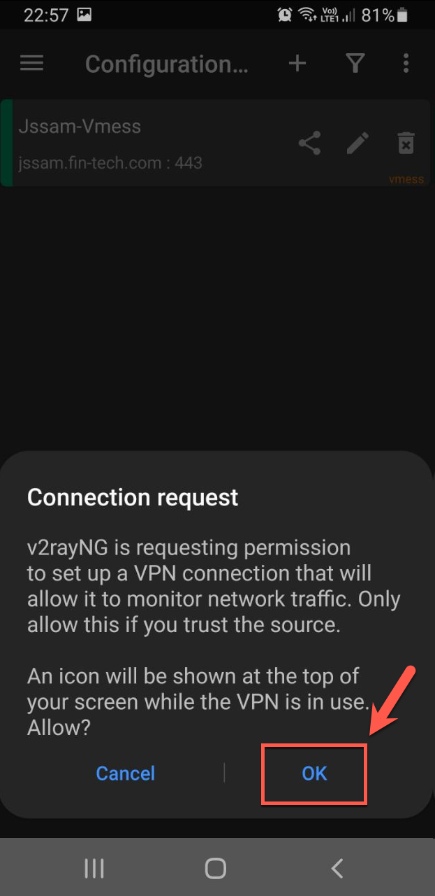
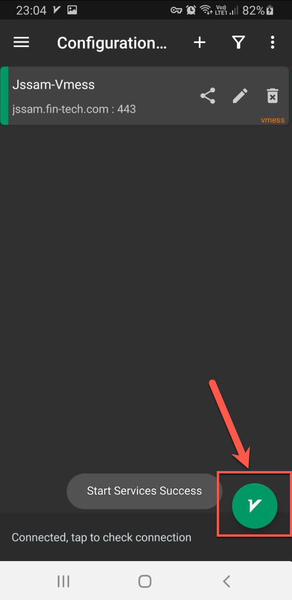

# Android

## Installation

1. Download [V2rayNG](https://play.google.com/store/apps/details?id=com.v2ray.ang) from the Google Play store.

## Configuration
1. Copy the below URI to clipboard:
   ```vmess://ew0KICAidiI6ICIyIiwNCiAgInBzIjogIkZyZWUgSXJhbiIsDQogICJhZGQiOiAianNzYW0uZmluLXRlY2guY29tIiwNCiAgInBvcnQiOiAiNDQzIiwNCiAgImlkIjogIjExMzAzZGJlLTBmMDktNGE0Yy1hM2ZmLTdkMTlhMDkyMzhiZCIsDQogICJhaWQiOiAiMCIsDQogICJzY3kiOiAiYXV0byIsDQogICJuZXQiOiAid3MiLA0KICAidHlwZSI6ICJub25lIiwNCiAgImhvc3QiOiAianNzYW0uZmluLXRlY2guY29tIiwNCiAgInBhdGgiOiAiL2NvbnRyb2wiLA0KICAidGxzIjogInRscyIsDQogICJzbmkiOiAianNzYW0uZmluLXRlY2guY29tIiwNCiAgImFscG4iOiAiIg0KfQ==```
2. Run the ***V2rayNG*** app
3. On the ***Configuration*** screen, click the ***+*** icon to add a server
4. Select ***Import config from clipboard***

    {:style="height:50%;width:50%"}

5. Successful import confirmation should be displayed:

    {:style="height:50%;width:50%"}

6. Click on the connect button to connect the VPN

    {:style="height:50%;width:50%"}

7. For the first time only, approve the first use connection request

    {:style="height:50%;width:50%"}

8. Enjoy the internet!


## Disconnection

To disconnect from the service, open ***V2rayNG*** and from the main screen, click on the connect/disconnect icon to disconnect:

{:style="height:50%;width:50%"}
