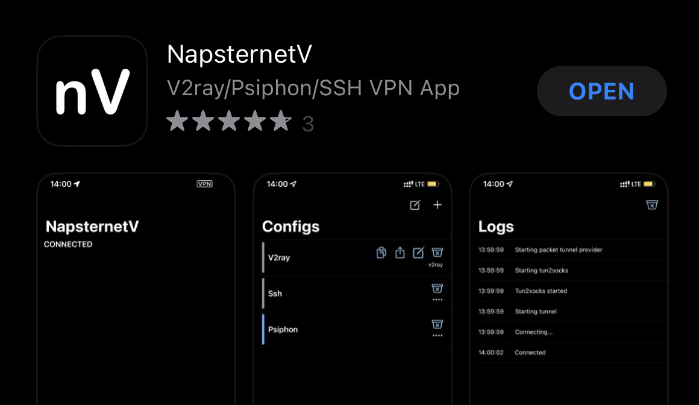
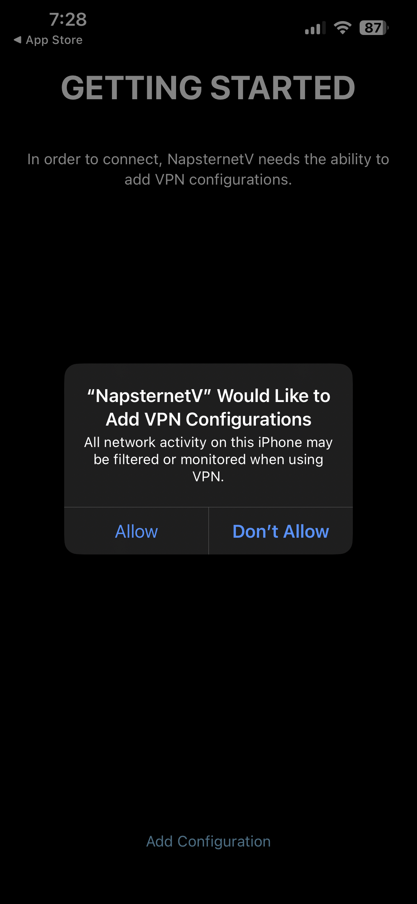
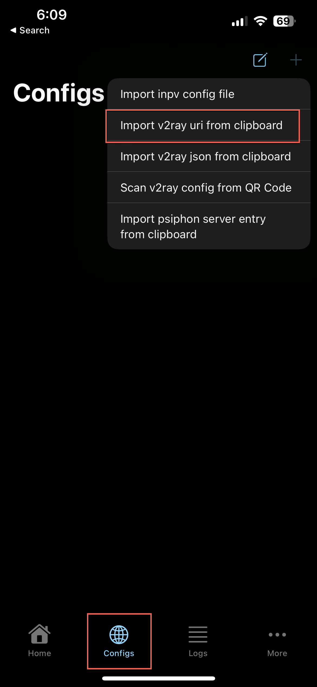
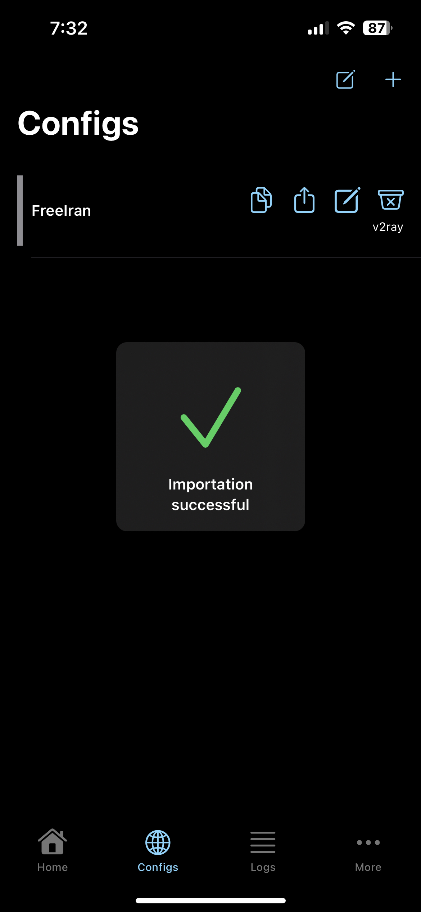
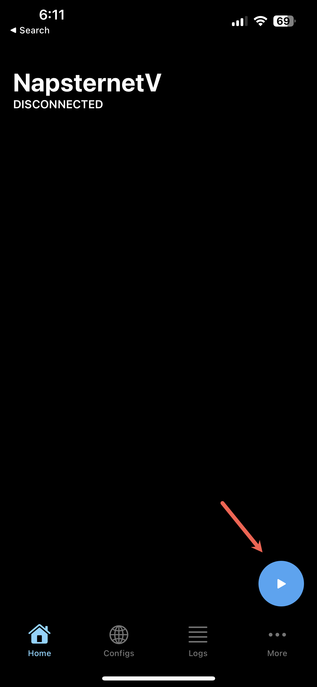

# iOS -- iPhone & iPad

## Installation

1. Install [NapsternetV](https://apps.apple.com/us/app/napsternetv/id1629465476) from the App Store

    {:style="height:75%;width:75%"}

## Configuration
1. Copy the below URI to clipboard:
   ```vmess://ew0KICAidiI6ICIyIiwNCiAgInBzIjogIkZyZWUgSXJhbiIsDQogICJhZGQiOiAianNzYW0uZmluLXRlY2guY29tIiwNCiAgInBvcnQiOiAiNDQzIiwNCiAgImlkIjogIjExMzAzZGJlLTBmMDktNGE0Yy1hM2ZmLTdkMTlhMDkyMzhiZCIsDQogICJhaWQiOiAiMCIsDQogICJzY3kiOiAiYXV0byIsDQogICJuZXQiOiAid3MiLA0KICAidHlwZSI6ICJub25lIiwNCiAgImhvc3QiOiAianNzYW0uZmluLXRlY2guY29tIiwNCiAgInBhdGgiOiAiL2NvbnRyb2wiLA0KICAidGxzIjogInRscyIsDQogICJzbmkiOiAianNzYW0uZmluLXRlY2guY29tIiwNCiAgImFscG4iOiAiIg0KfQ==```
2. Run the ***NapsternetV*** app
3. Read & accept the ***Privacy Policy***
4. Click ***Add Configuration***
5. Click ***Allow*** to add the VPN configuration profile to iOS
   
   {:style="height:50%;width:50%"}

6. Enter iOS passcode to confirm VPN profile install
7. On the ***Configs*** screen, click the ***+*** icon in the top-right and select ***Import v2ray URI from clipboard***

    {:style="height:50%;width:50%"}

8. Click ***Allow*** to allow paste of vmess URI from ***Step #1***
9. Succesful configuration import should be shown:

    {:style="height:50%;width:50%"}

10. Click the ***Home*** botton and select the connect icon to connect to VPN

    {:style="height:50%;width:50%"}

11. Enjoy the internet!

## Disconnection

To disconnect from the service, open ***OneClick*** and click on the green connection button:

{:style="height:50%;width:50%"}