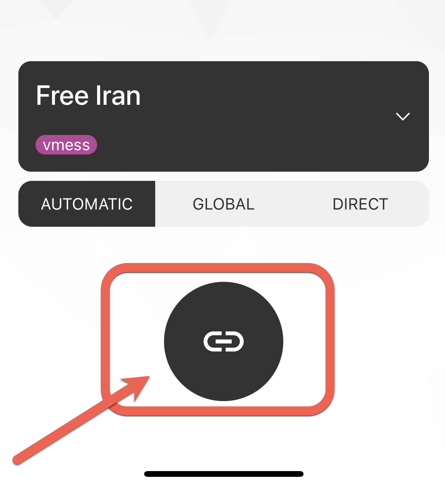
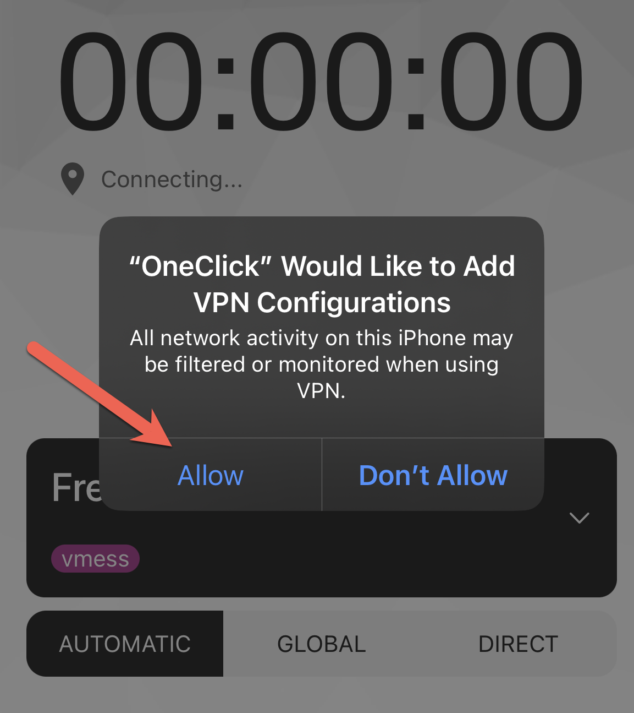
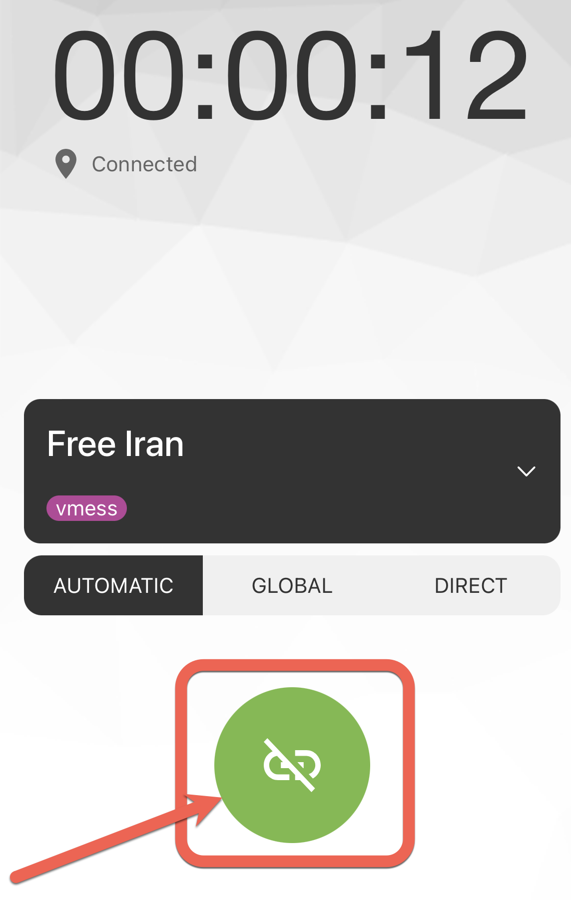

# :fontawesome-brands-apple: iOS -- iPhone & iPad

## :material-download: Installation

**1.** Download and run [OneClick](https://apps.apple.com/us/app/oneclick-safe-easy-fast/id1545555197) from the App Store

## :material-tools: Configuration
**1.** Click ***Add Server***

**2.** Click ***Scan QR Code***, using the below code:

</figure markdown>
{:loading=lazy}
</figure>

**3.** Click the connect button

</figure markdown>
{:loading=lazy style="height:50%;width:50%;"}
</figure>

**4.** Select ***Allow*** to allow the VPN Configuration installation

</figure markdown>
{:loading=lazy style="height:50%;width:50%;"}
</figure>

**5.** Enter your device PIN to confirm VPN configuration

**6.** Enjoy the internet!

??? success ":material-dns: Test Connection"

    To check if the proxy is properly configured and connected, you can test your connection below:

    <figure markdown>
    [Test Connection](/check/){ .md-button target=_blank}
    </figure>

## :material-lan-disconnect: Disconnection

To disconnect from the service, open ***OneClick*** and click on the green connection button:

</figure markdown>
{:loading=lazy style="height:50%;width:50%;"}
</figure>