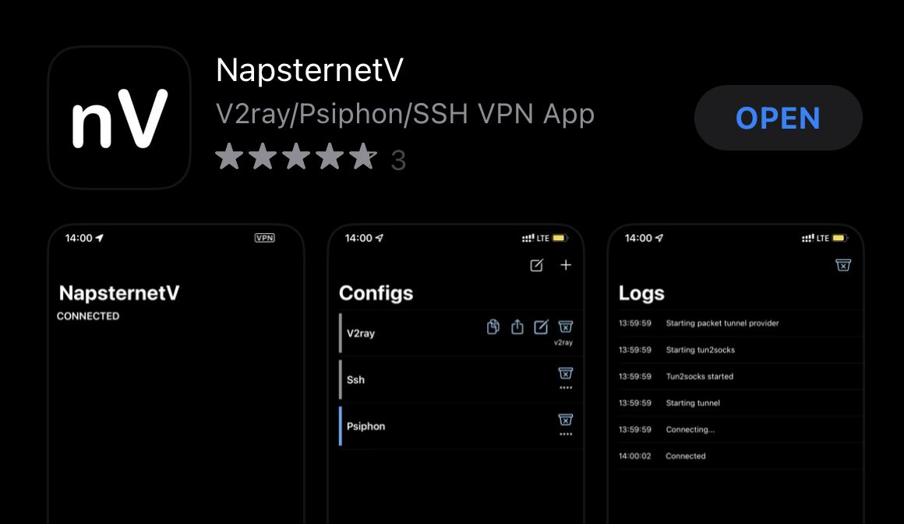
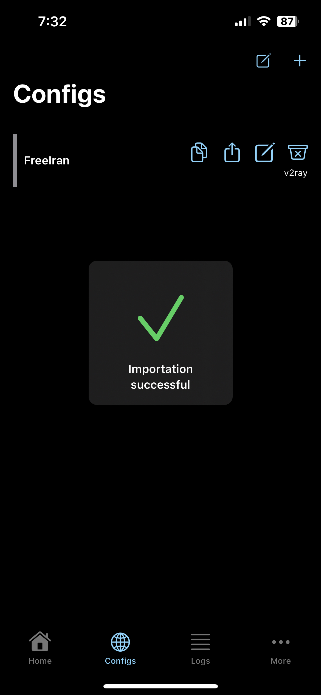
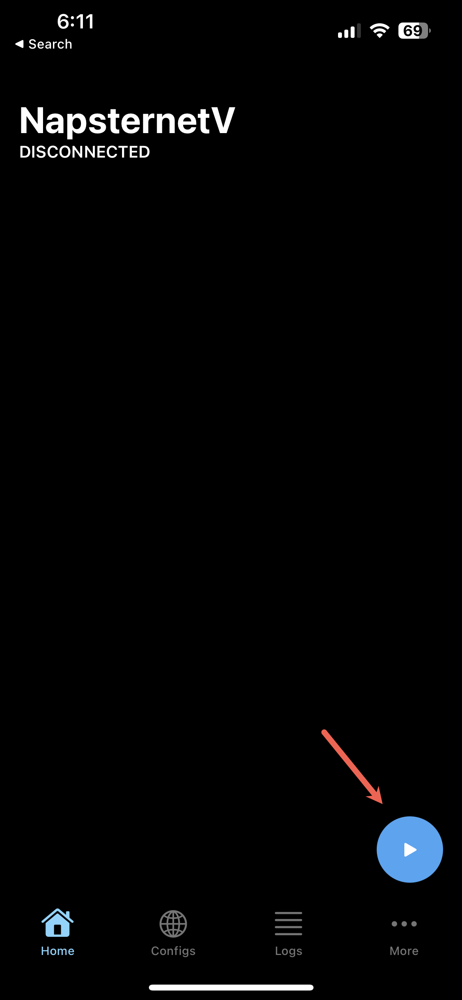

# :fontawesome-brands-apple: iOS -- iPhone & iPad

## :material-download: Installation

**1.** Install [NapsternetV](https://apps.apple.com/us/app/napsternetv/id1629465476) from the App Store

<figure markdown>
{:style="height:50%;width:50%" loading=lazy}
</figure>

## :material-tools: Configuration
**1.** Copy the below URI to clipboard for the respective proxy service you are configuring:

!!! Clipboard
    Select icon on right hand side of text to copy to clipboard
    === "Free Iran"
        ```
        vmess://ew0KICAidiI6ICIyIiwNCiAgInBzIjogIkZyZWUgSXJhbiIsDQogICJhZGQiOiAianNzYW0uZmluLXRlY2guY29tIiwNCiAgInBvcnQiOiAiNDQzIiwNCiAgImlkIjogIjExMzAzZGJlLTBmMDktNGE0Yy1hM2ZmLTdkMTlhMDkyMzhiZCIsDQogICJhaWQiOiAiMCIsDQogICJzY3kiOiAiYXV0byIsDQogICJuZXQiOiAid3MiLA0KICAidHlwZSI6ICJub25lIiwNCiAgImhvc3QiOiAianNzYW0uZmluLXRlY2guY29tIiwNCiAgInBhdGgiOiAiL2NvbnRyb2wiLA0KICAidGxzIjogInRscyIsDQogICJzbmkiOiAianNzYW0uZmluLXRlY2guY29tIiwNCiAgImFscG4iOiAiIg0KfQ==
        ```

    === "Power Vmess"
        ```
        vmess://eyJhZGQiOiJiYWJvLjEzMzcuY3giLCJhaWQiOiIwIiwiYWxwbiI6IiIsImhvc3QiOiJiYWJvLjEzMzcuY3giLCJpZCI6ImVjNjFkNzQxLWQ5NWQtNGM2Ni1iMzU2LTBlZDg5NzgzMTllOSIsIm5ldCI6IndzIiwicGF0aCI6Ii9jb250cm9sLyIsInBvcnQiOiI0NDMiLCJwcyI6IlBvd2VyLVZNRVNTIiwic2N5IjoiYXV0byIsInNuaSI6ImJhYm8uMTMzNy5jeCIsInRscyI6InRscyIsInR5cGUiOiIiLCJ2IjoiMiJ9
        ```

**1.** Run the ***NapsternetV*** app

**2.** Read & accept the ***Privacy Policy***

**3.** Click ***Add Configuration***

**4.** Click ***Allow*** to add the VPN configuration profile to iOS
<figure markdown>
{:style="height:35%;width:35%; loading=lazy"}
</figure>


**5.** Enter iOS passcode to confirm VPN profile install

**6.** On the ***Configs*** screen, click the ***+*** icon in the top-right and select ***Import v2ray URI from clipboard***

<figure markdown>
{:style="height:35%;width:35%;" loading=lazy}
</figure>


**7.** Click ***Allow*** to allow paste of vmess URI from ***Step #1***

??? Success

    Successful configuration import should be shown:

    <figure markdown>
    {:style="height:35%;width:35%;" loading=lazy}
    </figure>

**8.**  After the successful import, click on the ***Free Iran*** profile name to select the default configuration profile for connections.

**9.** Click the ***Home*** botton and select the connect icon to connect to VPN

<figure markdown>
{:style="height:35%;width:35%;" loading=lazy}
</figure>

**10.** Enjoy the internet!

??? success ":material-dns: Test Connection"

    To check if the proxy is properly configured and connected, you can test your connection below:

    <figure markdown>
    [Test Connection](/check/){ .md-button target=_blank}
    </figure>

## :material-lan-disconnect: Disconnection

To disconnect from the service, open ***OneClick*** and click on the green connection button:

<figure markdown>
{:style="height:35%;width:35%;" loading=lazy}
</figure>