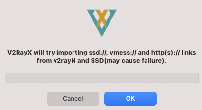
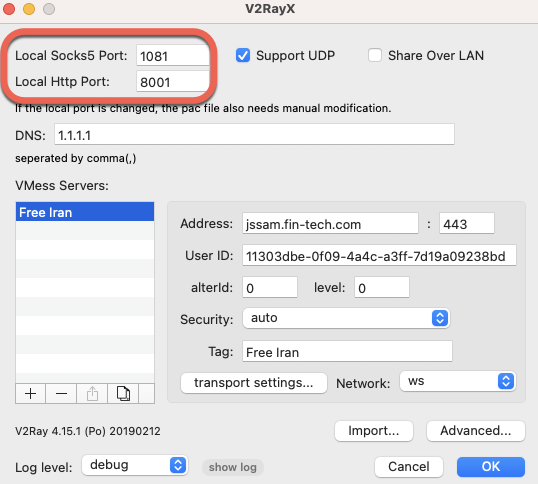

# :fontawesome-brands-apple: macOS

## :octicons-checklist-16: Prerequisite (Homebrew)
**1.** If you do not already have [***Homebrew***](https://brew.sh) installed on your macOS machine, do so first via typing the below in ***Terminal***:

!!! Terminal
    Select icon on right hand side of text to copy to clipboard
    ``` sh
    /bin/bash -c "$(curl -fsSL https://raw.githubusercontent.com/Homebrew/install/HEAD/install.sh)"
    ```

## :material-download: Installation
**1.** Install [V2RayX for macOS](https://github.com/Cenmrev/V2RayX) by typing the below in ***Terminal***:

!!! Terminal
    Select icon on right hand side of text to copy to clipboard
    ``` sh
    brew install v2rayx
    ```

**2.** Run V2rayX

## :material-tools: Configuration
**1.** In the system Toolbar, click on V2rayX and select ***Load core***

<figure markdown>
{:loading=lazy}
</figure>

!!! Warning
    If this step is not completed each time V2RayX is restarted, the proxy connections will not succeed.


**2.** Again from the system Toolbar, click on V2RayX and select ***Configure...***

<figure markdown>
{:loading=lazy}
</figure>

**3.** Select ***Support UDP*** and enter any desired DNS servers, comma delimited.  
<figure markdown>
{:loading=lazy}
</figure>

!!! Note
    **1.1.1.1** is the IP address of CloudFlare's free & redundant primary public DNS server.

**4.** Click ***Import*** and select ***Import from other links...***

<figure markdown>
{:loading=lazy}
</figure>

**5.** Copy the below URI to clipboard for the respective proxhy service you are configuring, and paste the link into V2RayX:
   
!!! Clipboard
    Select icon on right hand side of text to copy to clipboard
    === "Free Iran"
        ```
        vmess://ew0KICAidiI6ICIyIiwNCiAgInBzIjogIkZyZWUgSXJhbiIsDQogICJhZGQiOiAianNzYW0uZmluLXRlY2guY29tIiwNCiAgInBvcnQiOiAiNDQzIiwNCiAgImlkIjogIjExMzAzZGJlLTBmMDktNGE0Yy1hM2ZmLTdkMTlhMDkyMzhiZCIsDQogICJhaWQiOiAiMCIsDQogICJzY3kiOiAiYXV0byIsDQogICJuZXQiOiAid3MiLA0KICAidHlwZSI6ICJub25lIiwNCiAgImhvc3QiOiAianNzYW0uZmluLXRlY2guY29tIiwNCiAgInBhdGgiOiAiL2NvbnRyb2wiLA0KICAidGxzIjogInRscyIsDQogICJzbmkiOiAianNzYW0uZmluLXRlY2guY29tIiwNCiAgImFscG4iOiAiIg0KfQ==
        ```

    === "Power Vmess"
        ```
        vmess://eyJhZGQiOiJiYWJvLjEzMzcuY3giLCJhaWQiOiIwIiwiYWxwbiI6IiIsImhvc3QiOiJiYWJvLjEzMzcuY3giLCJpZCI6ImVjNjFkNzQxLWQ5NWQtNGM2Ni1iMzU2LTBlZDg5NzgzMTllOSIsIm5ldCI6IndzIiwicGF0aCI6Ii9jb250cm9sLyIsInBvcnQiOiI0NDMiLCJwcyI6IlBvd2VyLVZNRVNTIiwic2N5IjoiYXV0byIsInNuaSI6ImJhYm8uMTMzNy5jeCIsInRscyI6InRscyIsInR5cGUiOiIiLCJ2IjoiMiJ9
        ```

**6.** Click ***OK*** and then ***OK*** again to save the profile

## :fontawesome-solid-globe: Global System Proxy

To enable the proxy system-wide, click on the V2RayX application in the System Toolbar, and select ***Global Mode***:

<figure markdown>
{:loading=lazy}
</figure>

!!! Note
    To disable the Windows-wide proxy, use the same steps but select ***Manual Mode***, or quit the application.

## :globe_with_meridians: Per-Application Proxy
Instead of system-wide use, to enable use of the proxy on a per-application basis (e.g., for a specific web browser), use ***Manual Mode*** and in each desired application, manually configure the local machine proxy that V2RayX creates using server ***127.0.0.1*** and the SOCKS5 or HTTP port shown in V2RayX configuration.

Examples shown below use port ***1081*** for SOCKS5 and port ***8001*** for HTTP proxy:

<figure markdown>
{:loading=lazy}
</figure>

??? example "Firefox Example"
    To configure only the ***Firefox*** browser to send traffic via the proxy, apply the relevant settings in the browser ***Settings*** -> ***Proxy Settings***:

    <figure markdown>
    {:loading=lazy style="height:75%;width:75%"}
    </figure>

## :material-dns: Test Connection

To check if the proxy is properly configured and connected, you can test your connection below.

!!! Warning
    Ad Blockers may need to be disabled for this website in order for the test to run and not generate a blank page.

<figure markdown>
[Test Connection](../check/){ .md-button target=_blank}
</figure>

## :material-lan-disconnect: Disconnection

To disconnect from the service, either quit the application, or select ***Manual Mode*** and remove per-application proxy configuration if required (such as ***Firefox*** in the previous example).
