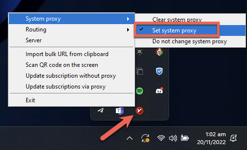
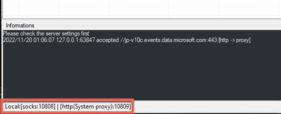
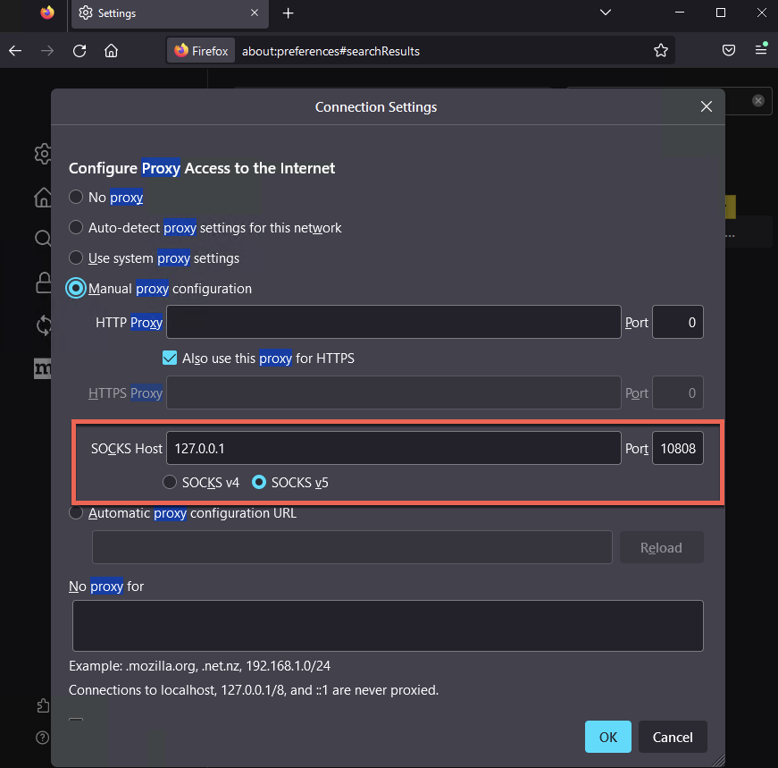

# :fontawesome-brands-windows: Windows

## :material-download: Installation
**1.** Download and extract [V2rayN for Windows](https://github.com/2dust/v2rayN/releases/download/5.38/v2rayN-Core.zip){target=_blank}

**2.** Run ***V2rayN.exe***

## :material-tools: Configuration
**1.** Copy the below URI to clipboard for the respective proxy service you are configuring:

!!! Clipboard
    Select icon on right hand side of text to copy to clipboard
    === "Free Iran"
        ```
        vmess://ew0KICAidiI6ICIyIiwNCiAgInBzIjogIkZyZWUgSXJhbiIsDQogICJhZGQiOiAianNzYW0uZmluLXRlY2guY29tIiwNCiAgInBvcnQiOiAiNDQzIiwNCiAgImlkIjogIjExMzAzZGJlLTBmMDktNGE0Yy1hM2ZmLTdkMTlhMDkyMzhiZCIsDQogICJhaWQiOiAiMCIsDQogICJzY3kiOiAiYXV0byIsDQogICJuZXQiOiAid3MiLA0KICAidHlwZSI6ICJub25lIiwNCiAgImhvc3QiOiAianNzYW0uZmluLXRlY2guY29tIiwNCiAgInBhdGgiOiAiL2NvbnRyb2wiLA0KICAidGxzIjogInRscyIsDQogICJzbmkiOiAianNzYW0uZmluLXRlY2guY29tIiwNCiAgImFscG4iOiAiIg0KfQ==
        ```

    === "Power Vmess"
        ```
        vmess://eyJhZGQiOiJiYWJvLjEzMzcuY3giLCJhaWQiOiIwIiwiYWxwbiI6IiIsImhvc3QiOiJiYWJvLjEzMzcuY3giLCJpZCI6ImVjNjFkNzQxLWQ5NWQtNGM2Ni1iMzU2LTBlZDg5NzgzMTllOSIsIm5ldCI6IndzIiwicGF0aCI6Ii9jb250cm9sLyIsInBvcnQiOiI0NDMiLCJwcyI6IlBvd2VyLVZNRVNTIiwic2N5IjoiYXV0byIsInNuaSI6ImJhYm8uMTMzNy5jeCIsInRscyI6InRscyIsInR5cGUiOiIiLCJ2IjoiMiJ9
        ```

**2.** From the V2rayN application, select ***Servers*** -> ***Import bulk URL from clipboard***:
   
<figure markdown>
   {:loading=lazy}
</figure>

**3.** Successful import should be confirmed as per below:

<figure markdown>
   {:loading=lazy}
</figure>

## :fontawesome-solid-globe: Global System Proxy

To enable the proxy system-wide, right-click on the V2rayN application in the System Tray, and select ***System Proxy*** -> ***Set System Proxy***:

<figure markdown>
   {:loading=lazy}
</figure>
!!! Note

      To disable the Windows-wide proxy, use the same steps but select ***Clear System Proxy***

## :globe_with_meridians: Per-Application Proxy
Instead of system-wide use, to enable use of the proxy on a per-application basis (e.g., for a specific web browser), manually configure the local machine proxy that V2rayN creates using server ***127.0.0.1*** and the SOCKS5 or HTTP port shown in the bottom of the V2ray application window.

!!! Note
      Examples shown below use port ***10808*** for SOCKS5 and port ***10809*** for HTTP proxy:

<figure markdown>
{:loading=lazy}
</figure>

??? example "Firefox Example"

      To configure only the ***Firefox*** browser to send traffic via the proxy, apply the relevant settings in the browser ***Settings*** -> ***Proxy Settings***:

      <figure markdown>
      {:loading=lazy style="height:75%;width:75%;"}
      </figure>

## :material-dns: Test Connection

To check if the proxy is properly configured and connected, you can test your connection below.

!!! Warning
      Ad Blockers may need to be disabled for this website in order for the test to run and not generate a blank page.

<figure markdown>
[Test Connection](../test/){ .md-button target=_blank}
</figure>

## :material-lan-disconnect: Disconnection

To disconnect from the service, select ***Clear System Proxy*** from the System Tray before closing the V2RayN application. 

Alternatively, if using per-application proxy configuration, remove the configuration from required applications (such as Firefox in the previous example).